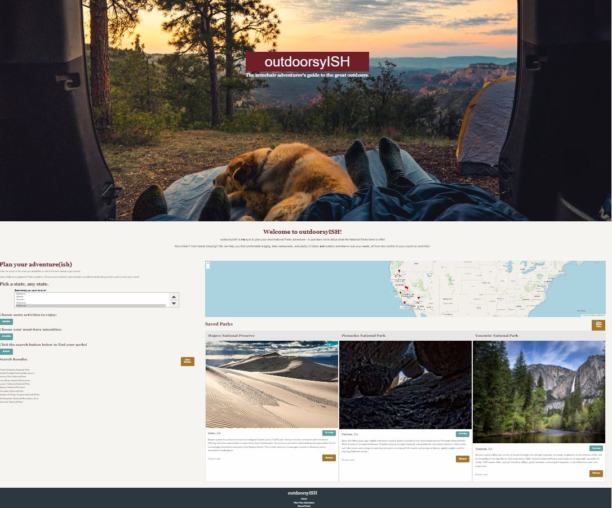

# outdoorsyISH - a National Park Planner for indoorsy people 
 outdoorsyISH is an application to plan a National Park experience for people who prefer the great indoors!!

# Description
We realize that there are lot of resources for people who love the great outdoors.  But some of us are a little too much in awe of adventures awaiting in our National Parks and don't know where to even start if we decide to enture out.  If the user belong to the latter category, we are here to help!

As we worked on this application, we relealized that our Natinal Parks offer more than 30 different types of activities, have 127 different amenities from 15 odd categories like Accessible, Food, Boating, Fishing etc.  This enables a very customizable expereince for all kind of people.  We hope that this application will help more people to enjoy the beauty and bounty of our National Parks which are our most precious treasure.

From the comfort of your couch, outdoorsyISH will help the user explore and find a National Park based on your location, interest and preferred transportation and help the user to plan activities, best routes, food and lodging.

## Table of Contents

- [Installation](#installation)
- [Usage](#usage)
- [Issues](#issues)
- [Enhancements](#enhancements)
- [Technology](#technology)
- [Credits](#credits)
- [License](#license)

## Installation

You can access:
1. the files in GitHub repository: https://github.com/danwillett/national-park-planner
2. the application using this URL: https://danwillett.github.io/national-park-planner/

## Usage

For version 1.0, outdoorsyISH will be taking location, activities and amenities to make suggestion for National Parks for the user. 

To begin the adventure, the user is required to choose one or mulitiple states.  Once the user have chosen a state or states:
1. The user can click on Find Parks button to see all the National parks in the state or states.
2. In addition, before clicking on Find parks button, the user can choose to select one or multiple activities or one or more amenities or both and then click on Find parks.
3. If there are parks which provide the choosen activities or amenities or both:
    * The relevant will be displayed in a list.
    * The relevant parks will be displayed on the map with a pin marking their position.
    * If there are no relevant parks, a message will be displayed. 
    * The last search is stored in the Local Storage and will be restored when the applciation is refreshed.  
4. On clicking the pin on the map or on the link in the list of parks, a modal dialog shows the park preview with link to the park website and a save button.
    * on clicking the link 'Check it out!', the user will be taken to the park's official website in a different tab.
    * on clicking the Save Park button, the park preview card will be saved in Saved Parks section under the map.
    * on clicking the remove button, the saved park will be removed from the Saved Parks.
5. The Clear button next to the List of Parks clears the search selection and the Local Storage so the user can start a new search.
6. The Clear Saved Parks button clears the Saved Parks from the Local Storage and from the application.
7. The website is responsive and will work on smaller screens.

Demo of the project:

## Issues

1. The restore from Local Storage is not currently working for Activities.
2. Resizing map labels with zoom can be improved.

## Enhancements
In version 1.1, we will be adding features to recommendation for fastest routes to a National Park and nearby food and lodging.  

## Technology
Public API Used;
 * [National Park Services API](https://www.nps.gov/subjects/developer/index.htm)
 * [Open Layers API](https://openlayers.org)

CSS Framework Used:
 * [Foundation](https://get.foundation/)

## Credits

Our Team:

* [Dan Willett](https://github.com/danwillett)
* [Marissa Thompson](https://github.com/marissa424)
* [Reed Keyes](https://github.com/rbkeyes)
* [Rima Bhumbla](https://github.com/rbhumbla1)

# Resources

* [Foundation](https://get.foundation/index.html)
* [NPS API Documentation](https://www.nps.gov/subjects/developer/api-documentation.htm)
* [Open Layer Documentation](https://openlayers.org/en/latest/apidoc/)

